# ImageToCaption_Encoder_Decoder

| Image                      | Layer 1                             | Layer 2                             | Layer 3                             |
| -------------------------- | ----------------------------------- | ----------------------------------- | ----------------------------------- |
|   | 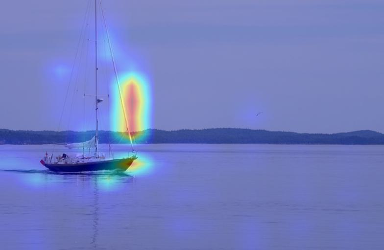  | 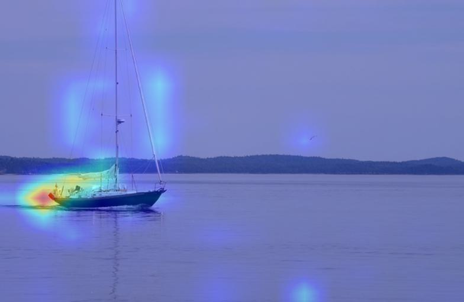  | 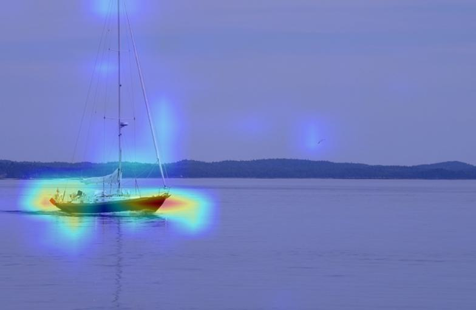  |
|    | 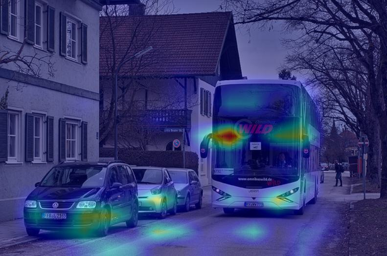   | 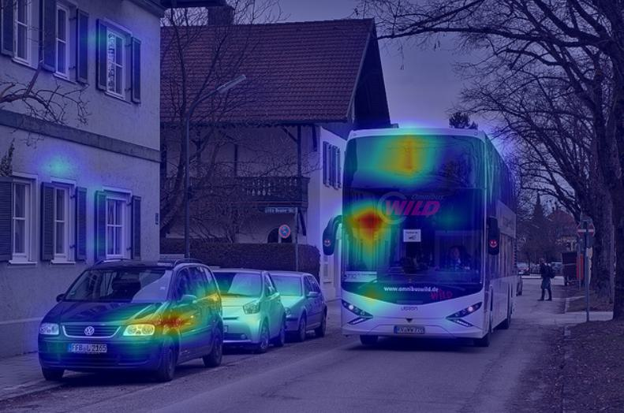   |    |
|  | 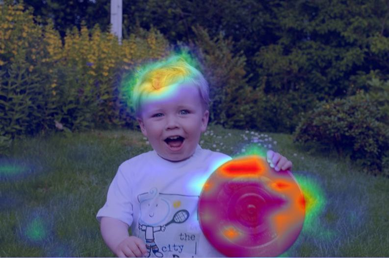 | 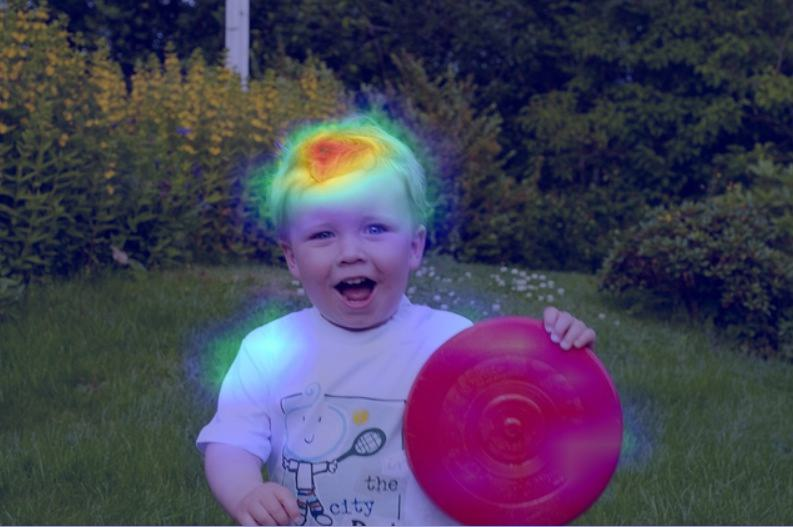 | 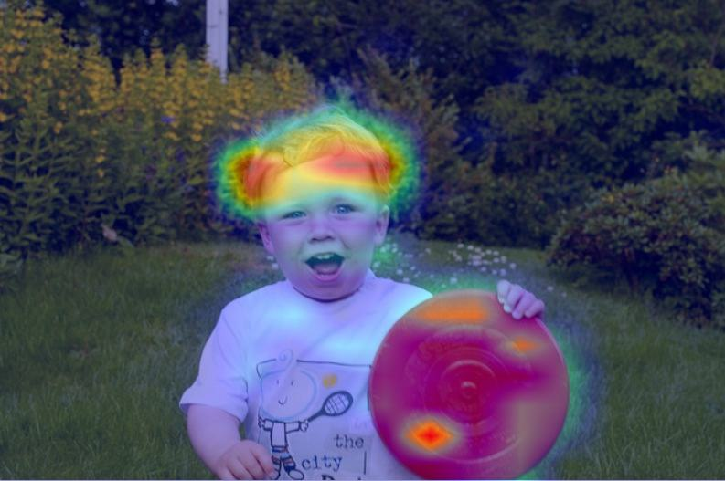 |
|    | 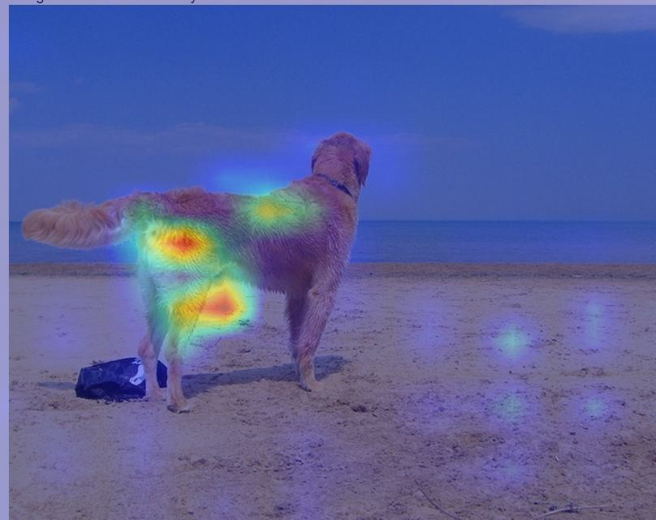   | 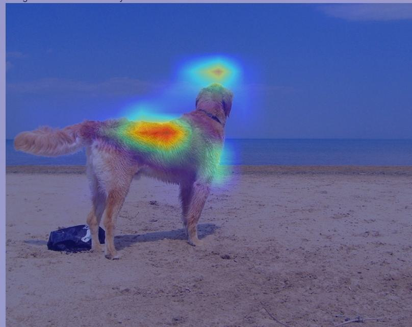   | 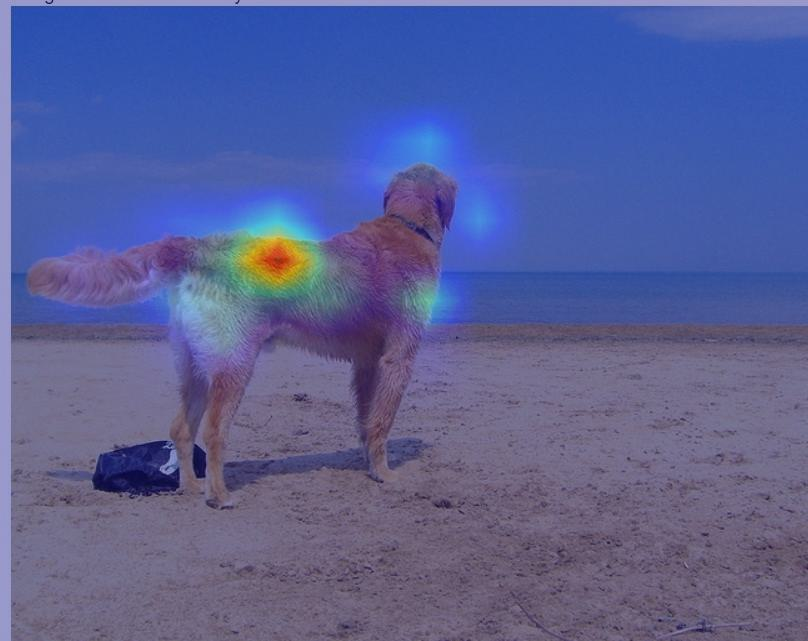   |
|  | 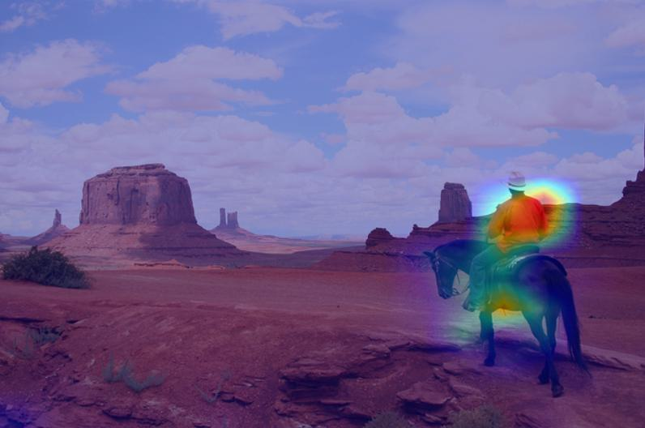 | 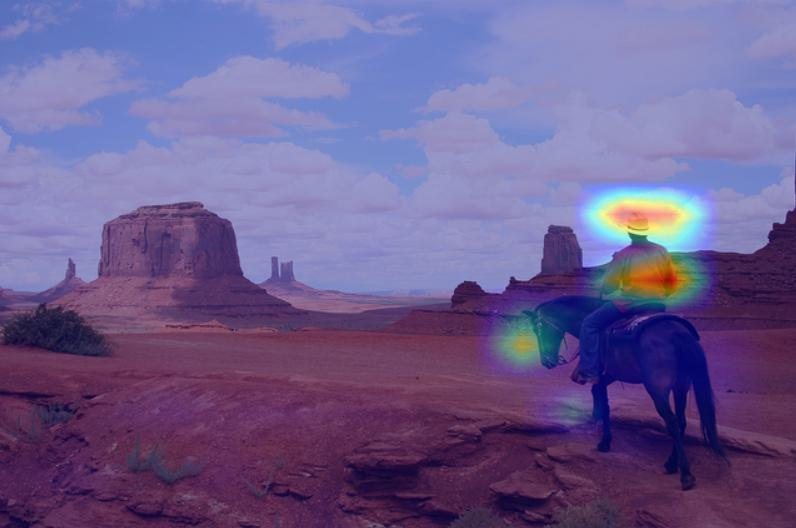 | 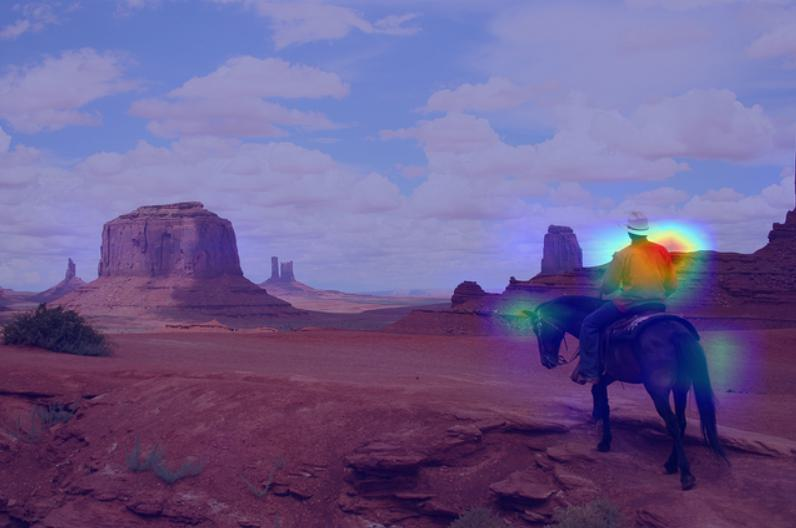 |

| Image                                       | Reference Caption                           | Model 1                                          | Model 2                                      |
|---------------------------------------------|---------------------------------------------|--------------------------------------------------|----------------------------------------------|
|      | A small boat in the ocean .                 | a boat is sitting on a boat overlooking water     | a boat is sailing over the water             |
|       | Bus driving by parked cars .               | a group of people are walking down a street      | a bus is parked on a street                  |
|     | Child holding red frisbee outdoors .        | a little boy in a red shirt is holding a toy frisbee | a young boy with a red frisbee in the grass |
|       | Dog on a beach by the ocean .               | a dog stands in front of a large body of water   | a brown dog stands on the sand near the ocean |
|     | A cowboy riding a horse in the desert .     | two people walking on a sandy path               | two people are riding a horse on a mountain |

# Encoder-Decoder Architecture
$$
\boxed{\textbf{ENCODER:}}
\rightarrow
\boxed{\text{Image}}
\rightarrow
\boxed{\text{DINOv2 spatial tokens}}
$$

$$
\textbf{DECODER:}
\boxed{\text{Word embeddings + Positional Encoding}}
\rightarrow
\boxed{\text{Self-Attention}}
\rightarrow
\boxed{\text{Cross-Attention Layers (Image Embeddings)}}
\rightarrow
\boxed{\textbf{Softmax}(\text{Word embeddings})}
$$

