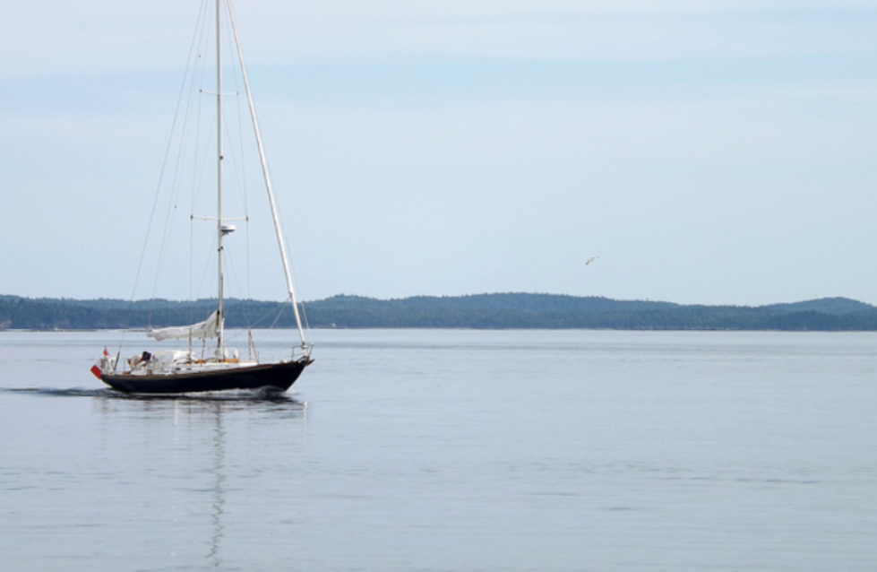
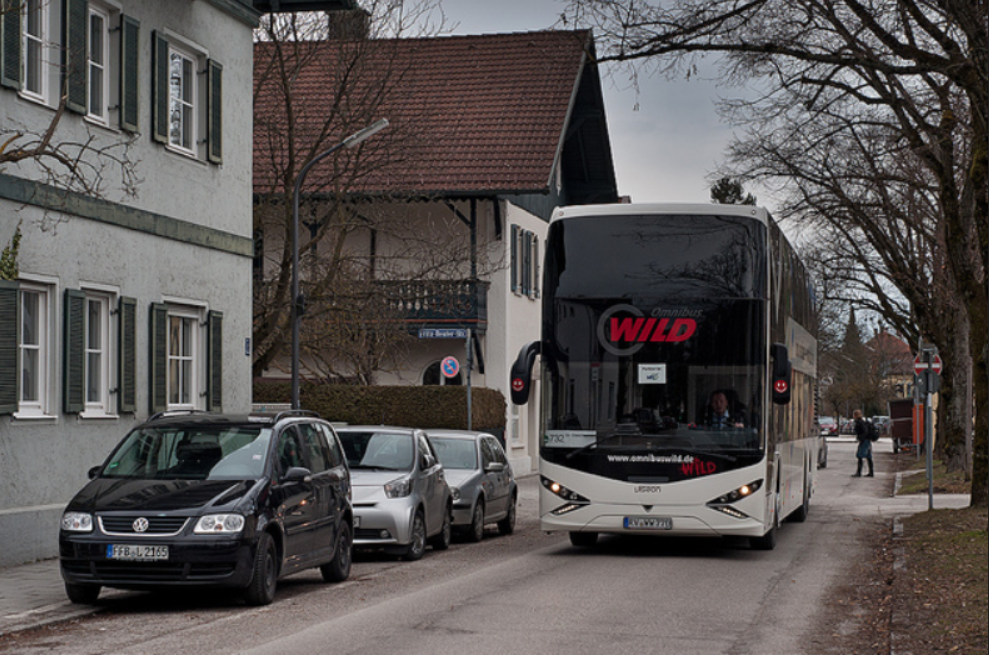
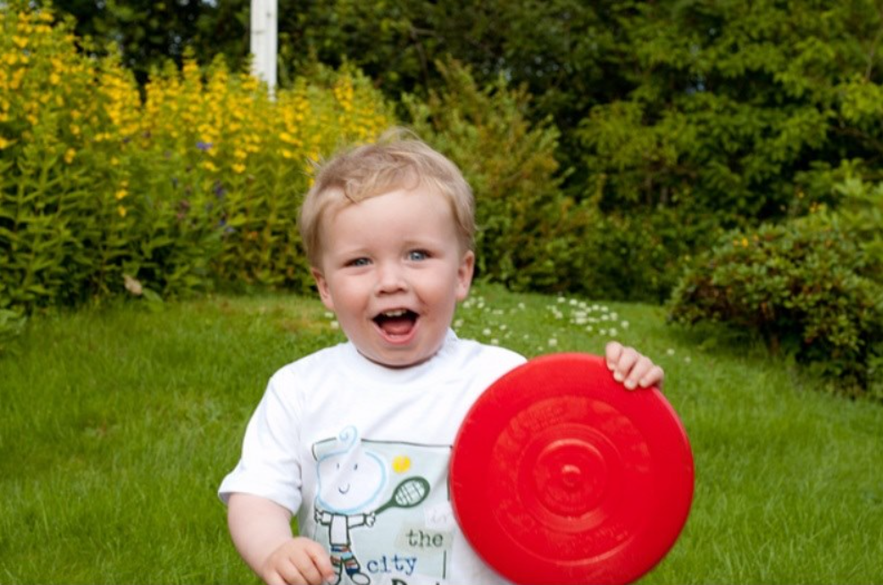
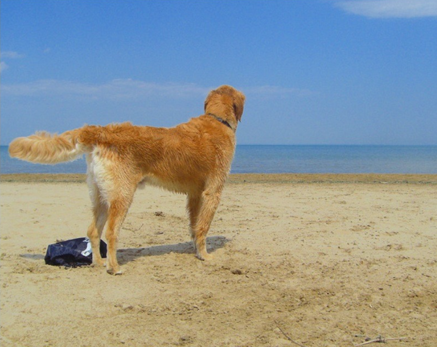
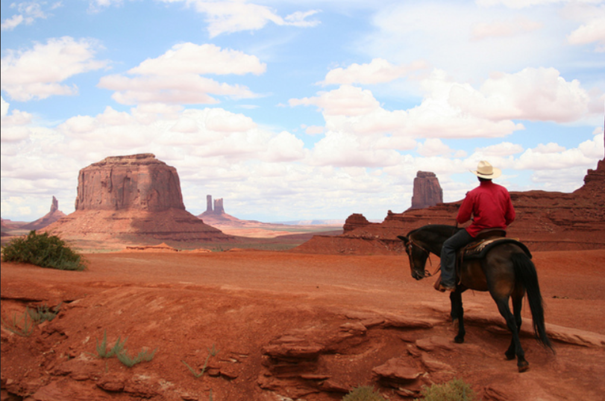
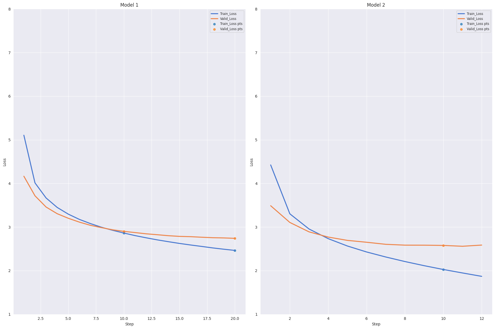

# ImageToCaption_Encoder_Decoder

| Image                                           | Reference Caption                           | Model 1                                          | Model 2                                      |
|-------------------------------------------------|---------------------------------------------|--------------------------------------------------|----------------------------------------------|
| {: width="100px"}         | A small boat in the ocean .                 | a boat is sitting on a boat overlooking water     | a boat is sailing over the water             |
| {: width="100px"}          | Bus driving by parked cars .               | a group of people are walking down a street      | a bus is parked on a street                  |
| {: width="100px"}        | Child holding red frisbee outdoors .        | a little boy in a red shirt is holding a toy frisbee | a young boy with a red frisbee in the grass |
| {: width="100px"}          | Dog on a beach by the ocean .               | a dog stands in front of a large body of water   | a brown dog stands on the sand near the ocean |
| {: width="100px"}        | A cowboy riding a horse in the desert .     | two people walking on a sandy path               | two people are riding a horse on a mountain |

  
## BLEU Score 

| Model | BLEU-1 | BLEU-2 | BLEU-3 | BLEU-4 |
| ----- | ------ | ------ | ------ | ------ |
| 1     | 0.6240 | 0.4439 | 0.3065 | 0.2074 |
| 2     | 0.7035 | 0.5303 | 0.3884 | 0.2808 |

